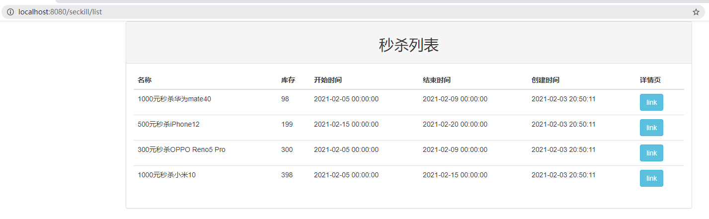
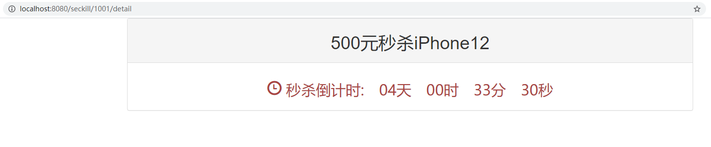
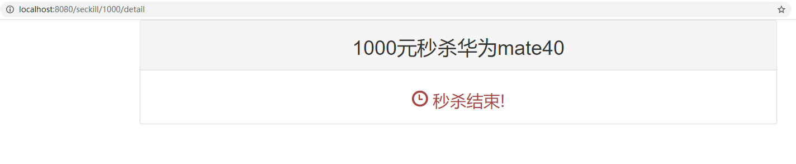
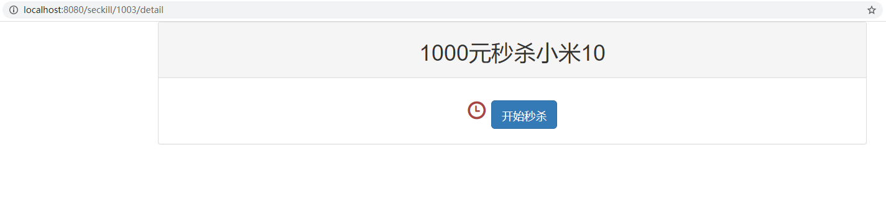
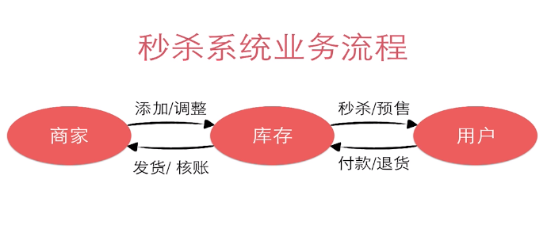
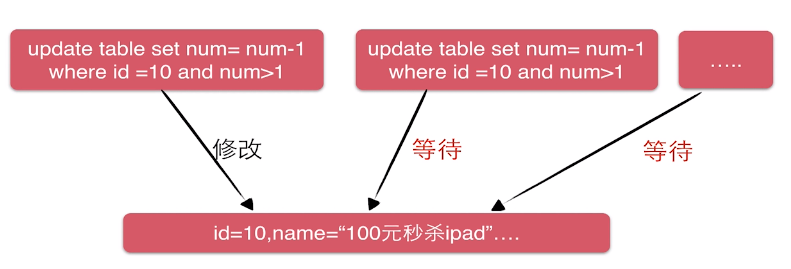

# 基于SSM实现高并发秒杀API

## 项目简介

该项目是[慕课网](https://www.imooc.com/)上的一个系列课程，主要内容是使用Java框架实现高并发秒杀API。

使用的框架：SpringMVC+Spring+MyBatis。

该系列课程分为四个子课程：

1. [Java高并发秒杀API之业务分析与DAO层](https://www.imooc.com/view/587)：对秒杀业务进行分析设计，以及DAO层的实现。
2. [Java高并发秒杀API之Service层](https://www.imooc.com/view/631)：Service层的设计和实现，基于Spring托管Service实现类，使用了Spring声明式事务。
3. [Java高并发秒杀API之web层](https://www.imooc.com/view/630)：Web层的设计和实现，使用SpringMVC整合spring，实现秒杀restful接⼝。
4. [Java高并发秒杀API之高并发优化](https://www.imooc.com/view/632)：高并发优化，分析了秒杀的瓶颈，然后针对瓶颈进行了优化。

**为什么选择SSM框架：**

1. 框架易于使用和轻量级
2. 低代码侵入性
3. 成熟的社区和用户群

**为什么选择秒杀系统：**

1. 具有典型“事物”特性
2. 秒杀/红包类需求越来越常见

**从本项目能学到什么：**

1. 框架的使用与整合技巧
2. 秒杀分析过程和优化思路

## 效果演示

秒杀列表页：

秒杀未开始：

秒杀已结束：

准备秒杀：

## 相关技术

1. Mysql：表设计、SQL技巧、事务和行级锁
2. MyBatis：DAO层设计与开发、MyBatis合理使用、MyBatis与Spring整合
3. Spring：Spring IOC整合Service、声明式事务运用
4. SpringMVC：Restful接口设计与使用、框架运作流程、Controller开发技巧
5. 前端：交互设计、BootStrap、jQuery
6. 高并发：高并发点与高并发分析、优化思路并实现

## 业务分析

秒杀业务的核心是**对库存的处理**，执行秒杀需要做两件事情：减库存、记录购买明细（谁购买、成功时间、付款/发货信息）。

**为什么需要事务？**

* 减库存却没有记录用户的购买明细，会导致商品的少卖
* 记录了用户的购买明细却没有减库存，会导致商品的超卖

有了事务的支持，就可以避免上述两种问题。

**难点分析：**
当 n 个用户在同一时间参加同一活动时，会产生”竞争“。

利用MySql解决竞争问题：事务+行级锁

事务工作机制：

* 开启事务Start Transaction
* **Update 库存数量**（竞争问题）
* Insert 购买明细
* Commit

行级锁工作机制：

**实现的秒杀功能：**

* 秒杀接口暴露
* 执行秒杀
* 相关信息查询

**项目编码开发：**

* [项目创建及配置依赖](./notes/0_init)
* [DAO设计编码](./notes/1_DAO)：数据库的表示问题、DAO的接口、MyBatis实现DAO
* [Service设计编码](./notes/2_Service)：接口设计、编码实现、通过spring管理、通过声明式事务简化事务控制
* [Web设计编码](./notes/3_Web)：RESTful设计、前端交互
* [高并发优化](./notes/4_Optimization)