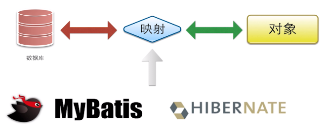

# DAO层设计与开发

接口设计+SQL编写

好处：代码和SQL分离，方便Review；DAO拼接等逻辑在Service完成

## 1. 数据库设计

根据需求，设计库存表和秒杀成功明细表，[数据库初始化脚本](../src/main/SQL/schema.SQL)。

项目包含两个表：库存表、用户秒杀信息表

秒杀库存表：**商品库存id**，商品名称，库存数量，秒杀开启时间，秒杀结束时间，秒杀创建时间字段

用户秒杀信息表：**商品库存id，用户手机号**，秒杀状态，秒杀行为创建时间字段


其他注意事项：

1. mySQL5.5 表中只能有一个字段是Timestamp类型，将其余列类型改为datetime类型就可以。

2. 只有InnoDB支持事务，所以显式地将engine设为InnoDB

3. 关于索引：KEY idx_start_time(start_time) 可以加速查询

   idx_start_time是索引名称，括号里面的是对应的字段名。索引用来快速地寻找那些具有特定值的记录，所有MySQL索引都以B-树的形式保存。如果没有索引，执行查询时MySQL必须从第一个记录开始扫描整个表的所有记录，直至找到符合要求的记录。表里面的记录数量越多，这个操作的代价就越高。如果作为搜索条件的列上已经创建了索引，MySQL无需扫描任何记录即可迅速得到目标记录所在的位置。

4. 为了防止一个用户对同一商品进行多次秒杀，可以考虑建立唯一联合主键（商品库存id，用户手机号）。


## 2. DAO实体类和接口

**实体类：**

实体类与数据库中的表格相对应，表格中的列对应类的属性。

[Seckill类](../src/main/java/org/seckill/entity/Seckill.java)与秒杀库存表相对应，[SuccessKilled类](../src/main/java/org/seckill/entity/SuccessKilled.java)与用户秒杀信息表相对应。

考虑到Seckill类与SuccessKilled类是一对多的关系，也就是一个seckill实体对应多个秒杀成功记录，所以在SuccessKilled类中新增了一个Seckill的复合属性，用来记录当前秒杀成功的商品信息。

**接口：**

一般情况下，DAO接口是根据具体的实体进行建立根据，设计增删改查的接口。

[SeckillDao](../src/main/java/org/seckill/dao/SeckillDao.java)：

* 减库存  `int reduceNumber(long seckillId, Date killTime);`
* 根据Id查询秒杀对象  `Seckill queryById(long seckillId);`
* 根据偏移量查询秒杀商品列表  `Seckill queryById(long seckillId);`

[SuccessKilledDao](../src/main/java/org/seckill/dao/SuccessKilledDao.java)：

* 插入购买明细，可过滤重复  `int insertSuccessKilled(long seckillId, long userPhone);`
* 根据id查询SuccessKilled并携带秒杀产品对象实体（需要用到SQL的链接）  `SuccessKilled queryByIdWithSeckill(long seckillId);` 


## 3. 基于MyBatis实现DAO

### 3.1 理论

**myBatis用来做什么？**



当我们去操作数据库的时候，会需要一个中间的映射过程，去映射到entity实体对象。JDBC、MyBatis、HIBERNATE都是用来做映射的。

JDBC需要我们用完全的手工的方式去拼写SQL，拿到查询结果和对应的数据：

```java
String SQL = "SELECT ... FROM persons WHERE id = 10"
DbCommand cmd = new DbCommand(connection, SQL);
Result res = cmd.Execute();
String name = res[0]["FIRST_NAME"];
```

对于MyBatis或者Hibernate，都是ORM对象-关系映射的框架，可以用编程语言将表或存储过程封装在类中，这样就不用编写SQL语句与数据库交互，而是使用对象的方法和属性：

```java
Person p = repository.GetPerson(10);
String name = p.FirstName;
```

**MyBatis特点：**


需要提供参数和SQL，直接返回实体或list封装。这里的SQL完全由程序员进行编写，提供了非常健壮的灵活性。

**SQL写在哪：**

MyBatis提供了两种方式：

* XML形式（建议）
* 注解形式（Java5.0后的新特性）

推荐在XML文件中编写SQL，有两个原因：注解本身还是java源码，修改之后还是要重新编译类；编写复杂的SQL逻辑时，注解处理起来就会非常繁琐，而xml本身提供了大量的标签，更方便封装。

**如何实现DAO接口：** 

* Mapper自动实现DAO接口（建议）
* API编程方式实现DAO接口

推荐使用Mapper自动实现，不需要手动再对接口进行实现，只需要关注SQL的编写以及如何设计DAO接口。


### 3.2 编程

首先在resources目录下新建[Mybatis全局的配置文件](../src/main/resources/mybatis-config.xml)

* 使用jdbc的getGeneratedKeys 获取数据库自增主键值
* 使用列别名替换列名  默认：true
* 开启驼峰命名转换：Table(create_time) —> Entity(createTime)

在resources目录下新建mapper文件夹，在文件夹下每个xml文件对应一个DAO接口，使用标签来执行SQL语句。

首先写入xml文件的mapper头：DTD(Document Type Definition)是用来规则定义文档规则的，用来验证下面的节点是否符合。mapper表示根节点，这是XML范畴的东西，叫 文档类型定义，简称DTD，用来验证当前的mapper(它是个XML文档)配置文件的有效性。

```xml
<!DOCTYPE mapper
        PUBLIC "-//mybatis.org//DTD Mapper 3.0//EN"
        "http://mybatis.org/dtd/mybatis-3-mapper.dtd">
```

**实现[SeckillDao映射](../src/main/resources/mapper/SeckillDao.xml)、[SuccessKilledDao映射](../src/main/resources/mapper/SuccessKilledDao.xml)：**

```xml
<!-- select是数据库操作类型 id是对应的接口名，resultType是返回值类型， parameterType是参数类型 -->
<select id="queryById" resultType="Seckill" parameterType="long">
    select seckill_id,name,number,start_time,end_time,create_time
    from seckill
    where seckill_id = #{seckillId};
</select>
```

其他注意事项：

* xml没有 `<=` 运算符，因为和xml语法冲突了，需要使用 `<![CDATA[ <= ]]>` 来告诉xml这不是xml语法
* 如何告诉 Mybatis 把结果映射到 SuccessKilled 同时映射 seckill 属性：
  * 通过别名的方式 `s.seckill_id as "seckill.seckill_id",<!-- as可省略 -->`

