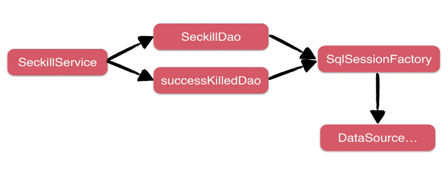

# Service层设计与开发

DAO层工作：接口设计+SQL编写

Service层工作：DAO拼接等逻辑在Service层完成

## 1. 秒杀业务接口设计与实现

首先创建service包，用来存放service接口和实现类

然后创建exception包，用来存放service所需要的异常，比如重复秒杀、秒杀关闭等

创建dto包数据传输层，存放表示数据的类型，关注web和service之间的数据传递

**Service接口设计：**

业务接口：站在”使用者“的角度设计接口

三个方面：

* 方法定义粒度
* 参数：简单、直接
* 返回类型（return 类型/异常）

实现的秒杀功能：

1. 查询所有秒杀记录  `List<Seckill> getSeckillList();`
2. 查询单个秒杀记录  `Seckill getById(long seckillId);`
3. 秒杀开始时，输出秒杀接口地址，否则输出系统时间和秒杀时间  `Exposure exportSeckillUrl(long seckillId);`
4. 执行秒杀操作  `SeckillExecution executeSeckill(long seckillId, long userPhone, String md5)
       throws SeckillException, RepeatKillException, SeckillException;`

**dto：**

需要在dto中建立暴露秒杀地址的类（[Exposure](../src/main/java/org/seckill/dto/Exposure.java)）、封装秒杀后的执行结果（[SeckillExecution](../src/main/java/org/seckill/dto/SeckillExecution.java)）

1. Exposure 判断是否可以参加秒杀：如果可以，返回秒杀标识符为true以及md5；如果不可以秒杀，返回秒杀标识符为false以及不能秒杀的原因
2. SeckillExecution 执行秒杀，返回秒杀结果：如果秒杀成功，返回秒杀成功状态以及商品信息；如果秒杀失败，返回秒杀失败状态以及失败原因

**exception：**

异常类

可以接受的有两种异常：

1. [重复秒杀异常](../src/main/java/org/seckill/exception/RepeatKillException.java)
2. [秒杀关闭异常（库存不足）](../src/main/java/org/seckill/exception/SeckillCloseException.java)

这两种异常都不希望导致程序意外中断，所以需要对这两种异常进行处理

**enum：**

枚举类型：存储常量的键值对

**Service接口实现：**

[实现Service接口](../src/main/java/org/seckill/service/impl/SeckillServiceImpl.java) 

## 2. 基于Spring管理Service依赖

**Spring IOC（依赖注入）功能理解：**

IOC首先会有一个创建对象的过程，也就是**对象工厂**，对象工厂可以帮我们创建service的实现。同时还会帮我们做**依赖管理**，比如说SeckillDao、SuccessKilledDao的依赖。最终给我们**一致性的访问接口**。

业务对象依赖图：

**为什么用IOC:**

* 对象创建统一托管
* 规范的生命周期管理
* 灵活的依赖注入：注解和编程
* 一致的获取对象方式

**Spring IOC注入方式和场景：**

| XML                                                          | 注解                                                         | Java配置类                                               |
| ------------------------------------------------------------ | ------------------------------------------------------------ | -------------------------------------------------------- |
| 1. Bean实现类来自于第三方类库，如DataSource等 2. 需要命名空间配置，如context、aop、mvc等 | 项目中自身开发使用的类，可直接在代码中使用注解，如@Service，@Controller等 | 需要通过代码控制第项创建逻辑的场景，如自定义修改依赖类库 |

**本项目IOC使用：**

* XML配置
* package-scan
* Annotation注解

**新建service相关的[配置文件](../src/main/resources/spring/spring-service.xml)：** 

* 扫描service包下所有使用注解的类型

## 3. 配置并使用spring声明式事务

**什么是声明式事务？**

开启事务 —> 修改SQL-1 —> 修改SQL-2 —> 修改SQL-n —> 提交/回滚事务

交由第三方框架进行自动管理

**声明式事务使用方式**

早期使用方式（2.0）：ProxyFactoryBean + XML

一次配置永久生效：tx:advice+aop命名空间

注解控制（推荐）：注解@Transactional

**使用注解控制事务方法的优点：** 

1. 开发团队达成一致约定，明确标注事务方法的编程风格。
2. 保证事务方法的执行时间尽可能短，不要穿插其他的网络操作，如RPC/HTTP请求/或者剥离到事务方法外部。
3. 不是所有的方法都需要事务，如只有一条修改操作，或者只读操作，不需要事务控制。

**什么时候回滚事务**

1. 抛出运行期异常（RuntimeException）
2. 小心不当的try-catch

**配置事务管理器**

在service相关的[配置文件](../src/main/resources/spring/spring-service.xml)中继续配置事务管理器

* 注入数据库的连接池
* 配置基于注解的声明式事务，默认使用注解来管理事务行为

## 4. 完成Service集成测试

