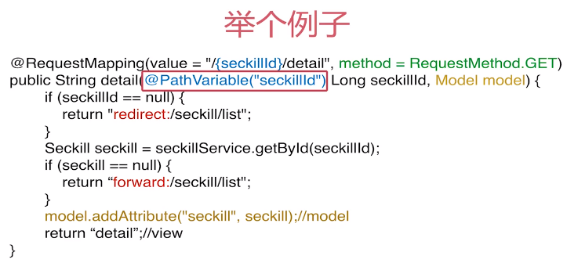

# web层设计与开发

## 1. 设计Restful接口

**前端页面流程：** 


**详情页流程逻辑：** 


**什么是Restful：** 

Restful是一种接口规范，是一种优雅的URl表述方式，是一种资源的状态和状态转移

GET --> 查询操作

POST --> 添加/修改操作 （非幂等操作）

PUT --> 修改操作 （幂等操作）

DELETE --> 删除操作

**URL设计：** 

/模块/资源/{标示}/集合1/...

如：/user/{uid}/friends 好友列表

在该项目中的URL设计与[实现](../src/main/java/org/seckill/web/SeckillController.java)：

GET /seckill/list 秒杀列表

GET /seckill/{id}/detail 秒杀详情页

GET /seckill/time/now 获取当前时间

POST /seckill/{id}/exposure 暴露md5

POST /seckill/{id}/{md5}/execution 执行秒杀


## 2. SpringMVC整合spring

**SpringMVC运行流程：** 


实际开发部分是模型部分，其他部分可以通过默认的注解形式非常方便的映射URL。

**HTTP请求地址映射原理：** 


**注解映射技巧：** 

@RequestMapping注解：

1. 支持标准的URL
2. Ant风格URL（？ * **等）
3. 带占位符{XXXXX}的URL

例如：

/user/\*/creation --> 匹配 /user/aaa/creation、/user/bbb/creation 等URL

/user/\*\*/creation --> 匹配 /user/creation、/user/aaa/bbb/creation 等URL

/user/{userId} --> 匹配 /user/123、/user/abc 等URL

**SpringMVC请求方法细节处理：** 

1. 请求参数绑定
2. 请求方式限制
3. 请求转发和重定向
4. 数据模型赋值
5. 返回json数据
6. cookie访问



**返回json数据：**

```java
@RequestMapping(value = "/{seckillId}/exposure",
                method = RequestMethod.POST,
                produces = {"application/json;charset=UTF-8"})
@ResponseBody //返回json数据
public SeckillResult<Exposure> exposure(@PathVariable Long seckillId){
    SeckillResult<Exposure> result; //将数据封装为json
    try {
        Exposure exposure = seckillService.exportSeckillUrl(seckillId);
        result = new SeckillResult<Exposure>(true, exposure);
    } catch (Exception e){
        logger.error(e.getMessage(), e);
        result = new SeckillResult<Exposure>(false, e.getMessage());
    }

    return result;
}
```

**整合配置SpringMVC框架：** 

首先在[web.xml](../src/main/webapp/WEB-INF/web.xml)中配置DispatcherServlet

新建[spring-web.xml](../src/main/resources/spring/spring-web.xml)配置springMVC：

1. 开启SpringMVC注解模式（简化配置）：
   * 自动注册DefaultAnnotationHandlerMapping, AnnotationMethodHandlerAdapter
   * 提供一系列：数据绑定，数字和日期的format @NumberFormat, @DataTimeFormat, xml, json默认读写支持
2. 静态资源servlet配置（servlet-mapping 映射路径：“/”）
   * 加入对静态资源的处理：js，gif，png
   * 允许使用“/” 做整体映射
3. 配置jsp 显示ViewResolver
4. 扫描web相关的bean


## 4. 测试部署web接口