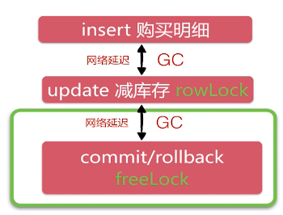

# 高并发优化

## 1. 高并发优化分析

**高并发发生在哪？**

图中红色部分是可能产生高并发的部分。

**CDN的理解：**

* CDN（内容分发网络）：加速用户获取数据的系统
* 部署在离用户最近的网络节点上
* 命中CDN不需要访问后端服务器
* 互联网公司自己搭建或租用

获取详情页的html或者js页面是不用访问我们秒杀系统的服务器的，那么每次调用页面都会获取系统时间，而时间是不会缓存在CDN上的，是否需要对**获取系统时间**这一步骤进行优化？

**获取系统时间**不需要优化：java访问一次内存大约需要10ns，也就是说一秒钟可以访问系统时间一亿次（不考虑GC），完全没有后端访问，所以不需要优化。

**地址暴露接口分析：**

* 无法使用CDN缓存：因为不是静态资源，是随着时间的推移变化的
* 适合服务端缓存：redis等
* 一致性维护成本低

优化：采用后端缓存

**执行秒杀操作优化分析：**

* 无法使用CND缓存：大部分的写操作和最核心的数据请求一般没法使用CDN
* 后端缓存困难：库存问题，不能在缓存中减库存，会产生数据不一致的问题，我们仍然需要MySQL的事务来保证数据的一致性
* 一行数据竞争：热点商品，瞬间会有大量用户参与，会产生大量的update减库存竞争

瓶颈分析：

行级锁是在Commit之后释放的，主要问题在于这一场端的事务在客户端进行，但是java和数据库通信的网络延迟很大，同时，同一行的事务是串行化运行的。

同城机房网络延迟在0.5ms~2ms，异地机房（北京-上海）网络延迟在20ms左右，如果出现一次GC时间在50ms左右。

优化：减少行级锁的持有时间，把客户端逻辑放到MySQL服务端，避免网络延迟和GC影响。

* 方案一：定制SQL方案：`update /* + [auto_commit] */`，需要修改MySQL源码
* 方案二：使用存储过程：整个事务在MySQL端完成

**优化总结：**

* 前端控制：暴露接口，按钮防重复
* 动静态数据分离：CDN缓存，后端缓存
* 事务竞争优化：减少事务锁时间

## 2. redis后端缓存优化编码

使用redis优化“地址暴露接口”

## 3. 并发优化

**优化1（简单优化）：**

调整顺序，insert语句可以并行发生

**优化2（深度优化）：** 

事务在MySQL端完成（存储过程）

## 4. 大型系统部署架构

**可能会用到哪些服务？**

* CDN（内容分发网络）：加速用户获取数据的系统，用户能在CND访问到的不需要再用后台的服务器
* WebServer: Nginx + Jetty
* Redis
* MySQL

**大型系统部署架构:**

**参与的角色**

* 开发：前端+后端
* 测试
* DBA
* 运维

## 5. 总结

**数据层技术：**

* 数据库设计和实现：表结构、列、索引，手写DDL
* MyBatis理解和使用技巧
* MyBatis整合Spring技巧：自动包扫描、别名识别

**业务层技术：**

* 业务接口设计和封装：从用户角度设计接口
* SpringIOC配置技巧：对第三方类库和一次性配置（如声明式事务）使用xml配置，对于我们开发的dao、service、controller使用注解
* Spring声明式事务使用和理解

**WEB技术：**

* Restful接口运用：设计规范与理解
* SpringMVC使用技巧：配置、参数映射、打包json
* 前端交互分析过程
* Bootstrap和JS使用

**并发优化：**

* 系统瓶颈点分析
* 事务、锁、网络延迟理解
* 前端、CDN、缓存等理解使用
* 集群化部署

**有生之年：**

